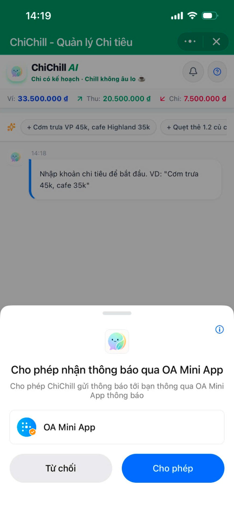
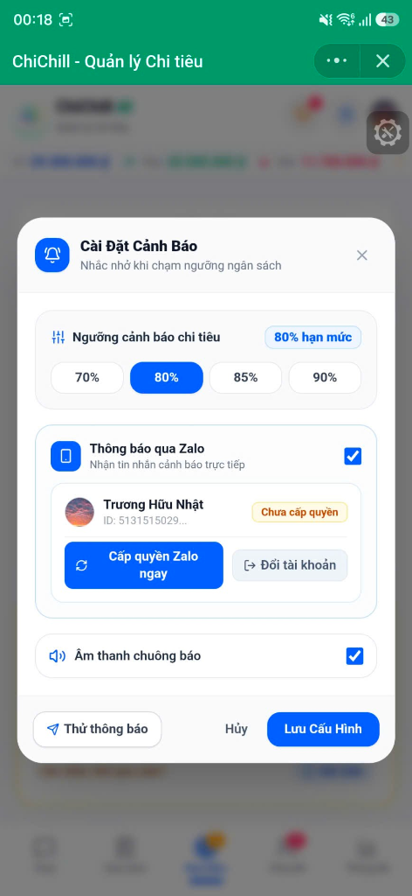
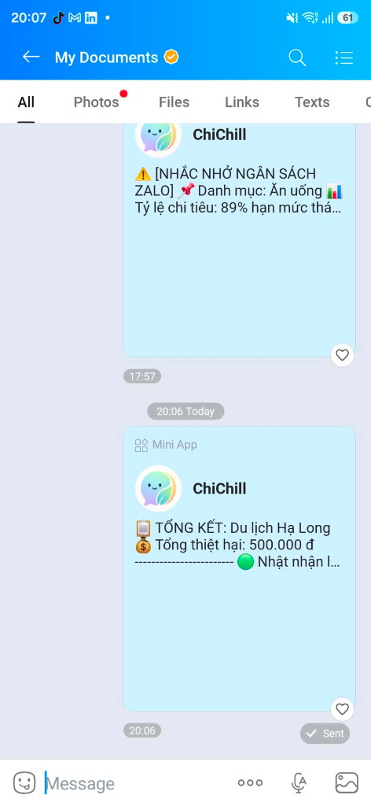

# ☕ ChiChill AI — Trợ Lý Tài Chính & Quản Lý Chi Tiêu Văn Phòng Thông Minh

> **"Chi có kế hoạch · Chill không âu lo ✨"**
> 
> *Ứng dụng Trợ lý Quản lý Chi tiêu Cá nhân & Chia Bill Nhóm thế hệ mới, tích hợp Trí tuệ Nhân tạo Google Gemini và đồng bộ đa nền tảng giữa Web & Zalo Mini App.*

---

## 🌟 Giới Thiệu Tổng Quan (Overview)

Quản lý tài chính cá nhân và chi tiêu nhóm thường đem lại cảm giác áp lực, nhàm chán và tốn thời gian. Dân văn phòng và giới trẻ thường xuyên gặp phải các rắc rối:
- **Lười nhập liệu:** Mở app lên phải bấm hàng chục bước chọn danh mục, gõ số tiền, ghi chú.
- **Tiếng lóng & Nhiều khoản cùng lúc:** Thói quen chat/nói bằng tiếng lóng (*"cơm 45k, cafe 35k", "quẹt thẻ 1 củ 2", "sếp ứng 1.5 củ"*) mà các app truyền thống không hiểu được.
- **Chia bill ăn trưa / du lịch rối rắm:** Một người trả trước cho cả nhóm, sau đó phải ngồi cộng trừ thủ công, chia tiền lẻ, gửi số tài khoản nhắc từng người rất ngại.
- **Sổ nợ khó đòi:** Tiền cho đồng nghiệp mượn lặt vặt ăn trưa, trà sữa quên không ghi lại hoặc ngại mở lời nhắc nợ.

## 📸 Hình Ảnh Giao Diện Thực Tế (App Showcase)

<div align="center">

| 📱 Giao diện chính ChiChill AI | ⚙️ Cài đặt Cảnh báo & Đồng bộ Zalo | 💬 Tin nhắn Chia Bill & Nhắc Nợ |
| :---: | :---: | :---: |
|  |  |  |
| *Chat AI bóc tách đa giao dịch & theo dõi số dư* | *Tùy chỉnh ngưỡng cảnh báo 80%/100% & Zalo ID* | *Tổng kết nhóm bill & cảnh báo ngân sách Zalo* |

</div>

---

## 🚀 Các Tính Năng Nổi Bật (Key Features)

### 🤖 1. Trợ Lý & Cố Vấn Tài Chính AI Thông Minh (AI Financial Coach & Advisor)
- **Bóc tách tiếng lóng Việt Nam chuẩn xác:** Tự động nhận diện các đơn vị tiền tệ dân dã như *củ, lít, xị, tr, k, đồng*, các thuật ngữ *cà bao, quẹt thẻ giùm, ứng trước, chia bill, vay mượn*.
- **Bóc tách đa giao dịch (Multi-Transactions) trong 1 câu:**
  - *Ví dụ:* `"Cơm trưa 45k, cafe Highland 35k và Grab 50k"` ➡️ Tự động tạo 3 giao dịch riêng biệt đúng danh mục và số tiền trong chớp mắt.
- **Cố vấn & Đánh giá sức khỏe tài chính:**
  - 📊 *"Đánh giá tài chính tháng này của tôi thế nào?"* ➡️ AI phân tích tương quan giữa tiến độ tháng, tỷ lệ tiết kiệm, cảnh báo các nhóm chi tiêu vượt hạn mức.
  - 🛍️ *"Đang tính mua tai nghe 2.5 củ, có nên không?"* ➡️ AI phân tích số dư khả dụng, số ngày còn lại trong tháng để đưa ra lời khuyên khách quan (*Nên mua / Nên đợi sau ngày nhận lương*).
  - 💡 *"Lương 20 triệu nên phân bổ thế nào để tiết kiệm 5 củ?"* ➡️ Gợi ý công thức phân bổ 50/30/20 hoặc 6 hũ tài chính trực tiếp trên thu nhập thực tế.
  - 👛 *"Giải thích vì sao số dư ví lại chênh lệch với thu chi tháng này?"* ➡️ Giải thích chi tiết sự khác nhau giữa số dư tích lũy trọn đời và giao dịch tháng hiện tại.
- **Động cơ suy luận kép (Dual Engine):**
  - **Gemini 2.5 Flash Cloud AI:** Phân tích ngôn ngữ tự nhiên sâu sắc, tư vấn thông minh.
  - **Local Heuristic Fallback Engine:** Chạy siêu tốc (< 10ms) trực tiếp trên máy kể cả khi offline hoặc server bận.

---

### 👥 2. Chia Bill Nhóm & Cộng Tác Zalo Đa Người Dùng (Collaborative Bill Splitting)
- **Tạo nhóm & Phân chia linh hoạt:**
  - Hỗ trợ chia đều cho cả nhóm, chia theo món từng người ăn, hoặc chia theo tỷ lệ/số tiền tùy chỉnh.
- **Cộng tác Zalo thời gian thực (Real-time Collaboration):**
  - Mỗi nhóm có một mã chia sẻ độc nhất (VD: `CHILL-7X2K`) và đường link Zalo Mini App sâu (`https://zalo.me/s/{APP_ID}/?bill={shareCode}`).
  - Nhiều thành viên cùng tham gia 1 nhóm, tự thêm khoản chi của mình (hiển thị Avatar & Tên Zalo thật của từng người).
  - Đồng bộ tức thì giữa các thành viên qua server Cloud.
- **Tối ưu hóa thanh toán (Smart Settlement) & VietQR:**
  - Thuật toán tự động tính toán bù trừ công nợ để số lượt chuyển tiền giữa các thành viên là ít nhất.
  - Tích hợp tạo mã **VietQR** chuẩn Napas 24/7 (tự động điền số tài khoản trưởng nhóm, số tiền chính xác từng người cần trả và nội dung chuyển khoản).

---

### 📒 3. Sổ Nợ Văn Phòng & Nhắc Nợ Khéo Léo (Office Debt & Receivable Tracker)
- **Quản lý công nợ 2 chiều:**
  - 🟢 **Người khác nợ mình (Receivables):** Tiền ăn trưa, cafe, tiền mua đồ hộ.
  - 🔴 **Mình nợ người khác (Payables):** Các khoản vay, tiền ứng trước cần trả đúng hẹn.
- **Nhắc nợ tế nhị 1 chạm qua Zalo:**
  - Tự động tạo mẫu tin nhắn nhắc nợ vui vẻ, khéo léo, đính kèm số tiền và thông tin STK/QR.
  - Mở trực tiếp Zalo Share Sheet để gửi cho bạn bè hoặc sao chép vào clipboard.

---

### 📊 4. Quản Lý Hạn Mức Ngân Sách (Budget Limits & Smart Alerts)
- **Thiết lập hạn mức linh hoạt:** Đặt hạn mức chi tiêu hàng tháng cho từng nhóm danh mục (*Ăn uống, Đi lại, Mua sắm, Công việc, Tiện ích, Giải trí...*).
- **Hệ thống cảnh báo 3 cấp độ:**
  - 🟢 **An toàn (< 80%):** Trạng thái "Rất Chill".
  - 🟡 **Cảnh báo (80% - 99%):** Nhắc nhở cân đối chi tiêu cho những ngày còn lại.
  - 🔴 **Báo động (≥ 100%):** Vượt hạn mức tháng.
- **Kênh thông báo đa dạng:**
  - Banner Toast nổi bật trực tiếp trong app.
  - Chuông âm thanh Web Audio sinh động.
  - Thông báo đẩy Zalo Mini App Push Notification (qua Zalo OA Template API).

---

### 📈 5. Báo Cáo & Phân Tích Tài Chính Trực Quan (Analytics & Insights)
- Biểu đồ phân bổ chi tiêu tròn (Donut Chart) theo tỷ lệ % từng danh mục.
- Theo dõi tỷ lệ tiết kiệm (Savings Rate) thực tế so với mục tiêu.
- Thống kê diễn biến thu nhập, chi tiêu, các khoản nợ cần thu theo từng chu kỳ tháng.

---

## 💻 Trải Nghiệm Trên Các Nền Tảng (Multi-Platform Experience)

```
                       ┌─────────────────────────────────┐
                       │     Google Gemini 2.5 Flash     │
                       └────────────────┬────────────────┘
                                        │
                       ┌────────────────┴────────────────┐
                       │      Backend Server (Render)    │
                       │     Node.js + Express + APIs    │
                       └───────┬─────────────────┬───────┘
                               │                 │
              ┌────────────────┴──────┐   ┌──────┴───────────────┐
              │   Web Application     │   │   Zalo Mini App      │
              │  (Máy tính / Laptop)  │   │  (iOS & Android Zalo)│
              └───────────────────────┘   └──────────────────────┘
```

### 📱 1. Trên Zalo Mini App (Điện thoại)
- **Truy cập:** Mở trực tiếp trong ứng dụng Zalo (quét mã QR hoặc tìm kiếm Mini App).
- **Trải nghiệm tức thì (Zero-Barrier Guest Mode):** Vào thẳng app sử dụng ngay không cần đăng nhập, **100% không có popup xin quyền gây phiền toái khi khởi động**.
- **Đăng nhập 1 chạm:** Bấm nút Zalo để liên kết tài khoản và đồng bộ dữ liệu lên Cloud.

### 🌐 2. Trên Web (Máy tính / Trình duyệt)
- **Truy cập:** Mở link triển khai trên trình duyệt (ví dụ: `https://chichill-app.onrender.com`).
- **Đăng nhập & Đồng bộ:**
  - Đăng nhập qua chuẩn **Zalo OAuth 2.0 (PKCE)**.
  - Hoặc nhập trực tiếp **Zalo User ID** trong mục Hồ sơ tài khoản để kéo toàn bộ dữ liệu từ điện thoại sang máy tính trong 1 giây.
- **Nhập mã chia bill:** Bấm *"Nhập mã"* để xem và chỉnh sửa nhóm chia bill cùng đồng nghiệp trên màn hình lớn.

---

## 🛠️ Kiến Trúc Công Nghệ (Tech Stack)

| Thành phần | Công nghệ sử dụng |
| :--- | :--- |
| **Frontend UI** | React 19, TypeScript, TailwindCSS, Lucide Icons, Vite |
| **Mobile SDK** | Zalo Mini App SDK (`zmp-sdk`), ZMP UI APIs |
| **Backend API** | Node.js, Express, TypeScript, Esbuild |
| **Trí tuệ Nhân tạo** | Google Gen AI SDK (`@google/genai`), Model `gemini-2.5-flash` |
| **Đồng bộ Dữ liệu** | Cloud Storage JSON Engine + Smart Merge (Hợp nhất thông minh) |
| **Triển khai (Deployment)** | Render (Backend & Web Hosting) + Zalo Mini App Platform |

---

## 📋 Tuân Thủ Chính Sách Kiểm Duyệt Zalo Mini App (ZMA Policy Compliance)

ChiChill AI được xây dựng tuân thủ **100% Chính sách Kiểm duyệt ZMA (Guidelines v6.1 - v6.3)**:

1. ✅ **Mục 6.1 (Ngữ cảnh xin quyền):** Tuyệt đối không tự động kích hoạt consent xin thông tin cá nhân (`getUserInfo`) hoặc quyền thông báo (`requestSendNotification`) khi vừa mở Mini App.
2. ✅ **Mục 6.2 (Minh bạch mục đích):** Chỉ xin quyền khi người dùng chủ động bấm nút (*Đăng nhập*, *Bật thông báo*) kèm thông điệp giải thích rõ ràng.
3. ✅ **Mục 6.3 (Xử lý khi từ chối quyền):** Nếu người dùng bấm *"Từ chối"*, app vẫn hoạt động bình thường ở chế độ Khách, không bị gián đoạn tính năng.
4. ✅ **Chuẩn Safe Area:** Header tùy biến không che khuất các nút điều hướng hệ thống của Zalo (`···` và `X`).

---

## 🚀 Hướng Dẫn Cài Đặt & Chạy Cục Bộ (Local Development)

### 1. Yêu cầu môi trường
- **Node.js:** Phiên bản `>= 18.0.0` (Khuyên dùng Node 20 LTS).
- **Trình quản lý gói:** `npm` hoặc `bun` / `yarn`.

### 2. Cài đặt Dependencies
```bash
# Clone repository
git clone <repo-url>
cd chichill---trợ-lý-tài-chính-văn-phòng

# Cài đặt thư viện
npm install
```

### 3. Cấu hình biến môi trường (.env)
Tạo file `.env` tại thư mục gốc với các thông số:
```env
# Google Gemini API Key
GEMINI_API_KEY=your_gemini_api_key_here

# Zalo Mini App Config
VITE_ZALO_APP_ID=3359280154790783177
ZALO_APP_SECRET=your_zalo_app_secret_here

# Backend URL (dành cho Web & Zalo Mini App kết nối)
VITE_BACKEND_URL=https://chichill-app.onrender.com

# Port Server
PORT=3000
```

### 4. Khởi chạy ứng dụng

```bash
# Chạy đồng thời Frontend Vite và Backend Express
npm run dev
```
- **Web App:** Mở `http://localhost:3000` trên trình duyệt.

### 5. Build và Đóng gói Zalo Mini App
```bash
# Build bundle và tự động cấu hình app-config.json
npm run build

# Deploy phiên bản mới lên Zalo Mini App Console
npx zmp deploy
```

---

## 📁 Cấu Trúc Thư Mục Dự Án (Project Structure)

```text
├── src/
│   ├── components/                 # Các Component giao diện chính
│   │   ├── AIChatView.tsx          # Giao diện Chat AI & Cố vấn tài chính
│   │   ├── TransactionListView.tsx # Danh sách & Bộ lọc giao dịch thu/chi
│   │   ├── BudgetView.tsx          # Quản lý & Cảnh báo hạn mức ngân sách
│   │   ├── DebtTrackerView.tsx     # Sổ nợ văn phòng
│   │   ├── BillSplitView.tsx       # Chia bill nhóm & Cộng tác Zalo
│   │   ├── AnalyticsView.tsx       # Biểu đồ & Thống kê tài chính
│   │   ├── Header.tsx              # Thanh điều hướng đầu trang & Profile badge
│   │   ├── AccountProfileModal.tsx # Modal Hồ sơ Zalo & Trạng thái đồng bộ
│   │   ├── NotificationSettingsModal.tsx # Cài đặt thông báo & Zalo OA push
│   │   ├── BudgetAlertToast.tsx    # Banner cảnh báo hạn mức nội bộ
│   │   └── LoginView.tsx           # Modal đăng nhập Zalo OAuth PKCE
│   ├── utils/                      # Các Module xử lý nghiệp vụ
│   │   ├── aiParser.ts             # Bộ tách ngữ nghĩa AI & Heuristic Fallback
│   │   ├── billSyncService.ts      # Dịch vụ đồng bộ & Deep link chia bill
│   │   ├── notificationService.ts  # Xử lý thông báo Zalo OA & Web Audio
│   │   ├── api.ts                  # Routing API thông minh (Render / Local / ZMP)
│   │   └── pkce.ts                 # Mã hóa PKCE bảo mật cho OAuth 2.0
│   ├── types.ts                    # Toàn bộ Type Definitions của hệ thống
│   ├── App.tsx                     # Main Application Controller & State Engine
│   └── main.tsx                    # Entry point React
├── server.ts                       # Backend Express REST API & Gemini AI Service
├── app-config.json                 # Cấu hình Zalo Mini App Platform
├── prepare-zmp.js                  # Script tự động trích xuất asset cho ZMP bundle
├── vite.config.ts                  # Cấu hình Vite Build
└── README.md                       # Tài liệu hướng dẫn dự án
```

---

## 📄 Bản Quyền & Giấy Phép (License)

Dự án được phát triển và vận hành bởi **ChiChill Team**. Mọi quyền được bảo lưu.

*☕ ChiChill AI — Chi có kế hoạch, Chill không âu lo!*
