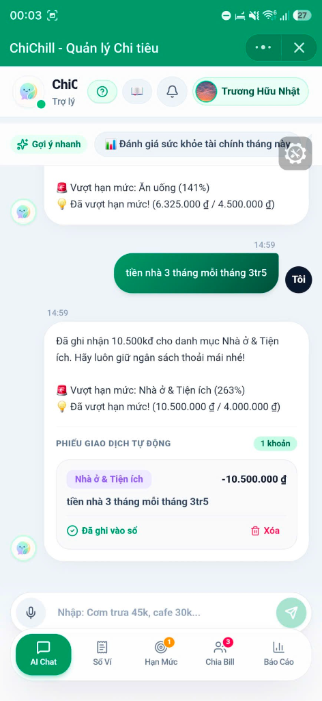
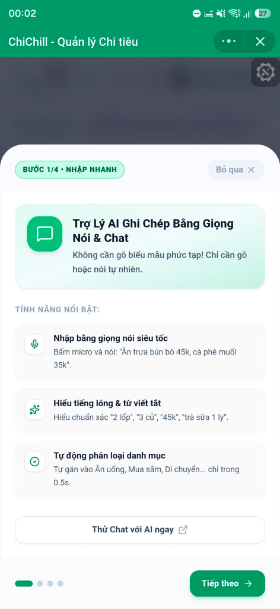
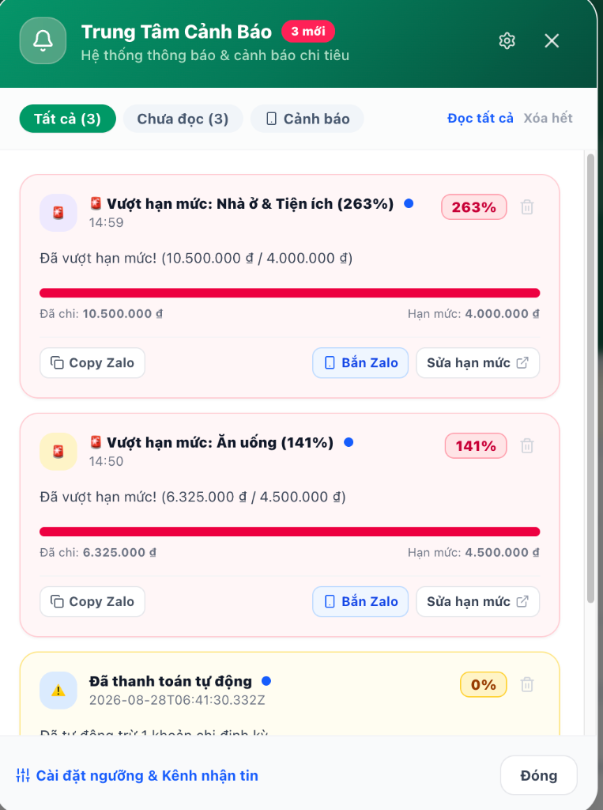
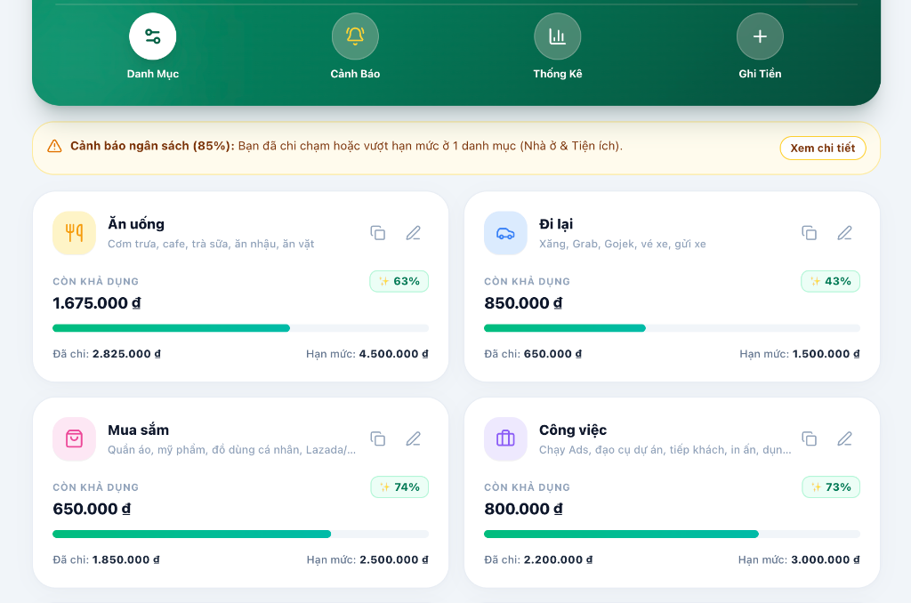

# ☕ ChiChill AI — Trợ Lý Tài Chính & Quản Lý Chi Tiêu Văn Phòng Thông Minh

> **"Chi có kế hoạch · Chill không âu lo ✨"**
> 
> *Ứng dụng Trợ lý Quản lý Chi tiêu Cá nhân & Chia Bill Nhóm thế hệ mới, tích hợp Trí tuệ Nhân tạo Google Gemini 3.6 Flash và triển khai Serverless trên Google Cloud Run & Zalo Mini App.*

---

## 🏆 Dự Án Tham Gia AI Riser Vietnam 2026: #BuildwithGoogleAI

ChiChill AI được xây dựng và tối ưu hóa 100% theo 3 trụ cột cốt lõi của chương trình **AI Riser Vietnam 2026**:

```
  ┌─────────────────────────────────────────────────────────────────────────────┐
  │                    AI Riser Vietnam 2026: #BuildwithGoogleAI                │
  ├─────────────────────────────────────────────────────────────────────────────┤
  │                                                                             │
  │  🧠 1. Brainstorm with Gemini:                                              │
  │     - Giải quyết bài toán quản lý tài chính văn phòng & chia bill nhóm.    │
  │     - Cố vấn sức khỏe tài chính, phân bổ ngân sách 50/30/20 & Wrapped AI.   │
  │                                                                             │
  │  🛠️ 2. Build in Google AI Studio:                                           │
  │     - Workspace: https://ai.studio/apps/df0c0c1e-63cf-4a6a-89c9-874b60d43c1b│
  │     - Prompt Engineering tiếng lóng Việt Nam (củ, lít, xị, tr, k, lốp...). │
  │     - Structured JSON Schema bóc tách đa giao dịch & Question Guardrails.   │
  │                                                                             │
  │  ☁️ 3. Deploy to Google Cloud Run:                                          │
  │     - Production URL: https://chichill-app-701475997592.asia-southeast1.run.app│
  │     - Đóng gói Docker Container nhẹ chuẩn `node:20-alpine`.                 │
  │     - Serverless Auto-scale 0 ➡️ N instances, Region `asia-southeast1`.     │
  │                                                                             │
  └─────────────────────────────────────────────────────────────────────────────┘
```

---

## 🌟 Giới Thiệu Tổng Quan (Overview)

Quản lý tài chính cá nhân và chi tiêu nhóm thường đem lại cảm giác áp lực, nhàm chán và tốn thời gian. Dân văn phòng và giới trẻ thường xuyên gặp phải các rắc rối:
- **Lười nhập liệu:** Mở app lên phải bấm hàng chục bước chọn danh mục, gõ số tiền, ghi chú.
- **Tiếng lóng & Nhiều khoản cùng lúc:** Thói quen chat/nói bằng tiếng lóng (*"cơm 45k, cafe 35k", "quẹt thẻ 1 củ 2", "tiền nhà 3 tháng mỗi tháng 3tr5"*) mà các app truyền thống không hiểu được.
- **Chia bill ăn trưa / du lịch rối rắm:** Mua đồ chung một bill nhưng mỗi người gọi món khác nhau, phải tự tính tiền từng món, phân bổ phí ship, trừ mã voucher giảm giá, gửi số tài khoản nhắc từng người rất ngại.
- **Sổ nợ khó đòi:** Tiền cho đồng nghiệp mượn lặt vặt ăn trưa, trà sữa quên không ghi lại hoặc ngại mở lời nhắc nợ.

---

## 📸 Hình Ảnh Giao Diện Thực Tế (App Showcase)

<div align="center">

| 💬 Chat & Voice AI Thông Minh | 🎓 Tour Hướng Dẫn 4 Bước | 🍕 Chia Bill Theo Từng Món & VietQR | 🎯 Hạn Mức Ngân Sách |
| :---: | :---: | :---: | :---: |
|  |  |  |  |
| *Chat AI bóc tách đa giao dịch & tự động cảnh báo hạn mức* | *Onboarding Story Cards giới thiệu trực quan 4 tính năng chính* | *AI bóc tách đơn hàng, tự phân bổ ship/voucher & VietQR động* | *Sửa hạn mức trực tiếp trên thẻ & cảnh báo chuông 3 cấp độ* |

</div>

---

## 🚀 Các Tính Năng Nổi Bật (Key Features)

### 🤖 1. Trợ Lý & Cố Vấn Tài Chính AI Thông Minh (AI Financial Coach & Advisor)
- **Bóc tách tiếng lóng Việt Nam chuẩn xác:** Tự động nhận diện các đơn vị tiền tệ dân dã như *củ, lít, xị, tr, k, lốp, đồng*, các thuật ngữ *cà bao, quẹt thẻ giùm, ứng trước, chia bill, vay mượn*.
- **Bóc tách đa giao dịch (Multi-Transactions) trong 1 câu:**
  - *Ví dụ:* `"Cơm trưa bún bò 45k, cafe Highlands 35k và Grab 50k"` ➡️ Tự động tạo 3 giao dịch riêng biệt đúng danh mục và số tiền trong chớp mắt.
- **Cố vấn & Đánh giá sức khỏe tài chính:**
  - 📊 *"Đánh giá tài chính tháng này của tôi thế nào?"* ➡️ AI phân tích tương quan giữa tiến độ tháng, tỷ lệ tiết kiệm, cảnh báo các nhóm chi tiêu vượt hạn mức.
  - 🛍️ *"Đang tính mua tai nghe 2.5 củ, có nên không?"* ➡️ AI phân tích số dư khả dụng, số ngày còn lại trong tháng để đưa ra lời khuyên khách quan.
  - 💡 *"Lương 20 triệu nên phân bổ thế nào để tiết kiệm 5 củ?"* ➡️ Gợi ý công thức phân bổ 50/30/20 hoặc 6 hũ tài chính trực tiếp trên thu nhập thực tế.
- **Spotify/ChiChill Wrapped Tổng Kết Cuối Tháng:**
  - Nhận xét chi tiêu mang phong cách *"Roast & Toast"* hài hước, mặn mòi (*"Chiến thần quẹt thẻ", "Chúa tể trà sữa"*).
- **Động cơ suy luận kép (Dual Engine):**
  - **Google Gemini 3.6 Flash Cloud AI:** Phân tích ngôn ngữ tự nhiên sâu sắc, tư vấn thông minh.
  - **Local Heuristic Fallback Engine:** Bộ phân tích Regex Heuristic tiếng Việt cục bộ chạy siêu tốc (< 10ms) đảm bảo ứng dụng không bao giờ bị gián đoạn.

---

### 🍕 2. Chia Bill Theo Từng Món & VietQR Nhóm Văn Phòng (Itemized Bill Split & VietQR)
- **2 Chế độ chia bill linh hoạt:**
  - ⚡ **Chia đều / Nhanh:** Chia đều tổng bill cho các thành viên.
  - 📋 **Chia theo từng món (Itemized Split):** Nhập danh sách từng món (tên món, số lượng, đơn giá, ai ăn món nào).
- **AI Bóc tách đơn hàng siêu tốc (AI Quick Order Parser):**
  - Chỉ cần copy tin nhắn order trong nhóm chat Zalo dán vào:  
    *VD: "Linh 1 trà sữa 45k, Hoàng 2 cf 70k, Nam 1 trà đào 40k, bánh 50k chia 3, ship 15k, voucher 20k"*  
    ➡️ AI tự động bóc tách từng món, gán đúng người, tự động chia đều tiền ship (+) và trừ mã giảm giá (-) cho từng người!
- **Tự động tạo mã VietQR Động (Dynamic VietQR Napas 24/7):**
  - Hỗ trợ toàn bộ các ngân hàng Việt Nam (*MB, VCB, TCB, VPB, ACB, TPB, BIDV, CTG, Timo, Cake...*).
  - Bấm nút **`[📱 Mã QR]`** ➔ Tự sinh mã QR nhúng đúng **chính xác số tiền cần trả** và **nội dung chuyển khoản** cụ thể. Mở app ngân hàng quét là chuyển tiền tức thì.
  - Hỗ trợ **Tải lên (Upload) ảnh QR cá nhân** (MoMo, ZaloPay, ViettelMoney, ảnh QR ngân hàng riêng).
- **Gửi kết quả chia bill vào Zalo 1 chạm:**
  - Tự động tạo tin nhắn tổng kết rõ ràng, kèm link cộng tác trực tiếp trên Zalo Mini App.

---

### 🎓 3. Onboarding Tour 4 Bước Hướng Dẫn Trực Quan (Interactive App Tour)
- **Trải nghiệm lần đầu mượt mà:** Modal dạng Story Cards xuất hiện nhẹ nhàng khi mở app lần đầu, có nút `[Bỏ qua]` ở góc trên.
- **4 Thẻ tính năng cốt lõi:**
  1. 🎙️ *Trợ lý AI Ghi chép bằng Giọng nói & Chat.*
  2. 🎯 *Hạn Mức Ngân Sách - Không lo cháy túi.*
  3. 🍕 *Chia Bill Nhóm & VietQR Tự Động.*
  4. 📊 *Báo Cáo Phân Tích & Sổ Nợ.*
- **Nút khám phá nhanh:** Mỗi bước có nút `[Xem tab này ngay]` để chuyển thẳng tới tính năng đó.
- **Xem lại bất kỳ lúc nào:** Bấm nút **`[🎓 Tour App]`** trên thanh Header hoặc trong màn hình Hồ sơ cá nhân.

---

### 📊 4. Quản Lý Hạn Mức Ngân Sách & Cảnh Báo Thông Minh (Budgeting & Alerts)
- **Sửa / Xóa hạn mức trực tiếp trên từng thẻ:** Không cần qua màn hình cài đặt phức tạp, chạm trực tiếp vào thẻ ngân sách để chỉnh sửa hoặc xóa nhanh.
- **Hệ thống cảnh báo 3 cấp độ:**
  - 🟢 **An toàn (< 80%):** Trạng thái "Rất Chill".
  - 🟡 **Cảnh báo (80% - 99%):** Nhắc nhở cân đối chi tiêu cho những ngày còn lại.
  - 🔴 **Báo động (≥ 100%):** Vượt hạn mức tháng.
- **Kênh thông báo đa dạng:** Banner Toast nổi bật, chuông âm thanh Web Audio, thông báo đẩy Zalo Push Notification.

---

### 📈 5. Báo Cáo Phân Tích Tương Tác (Interactive Analytics & Drill-Down)
- **Biểu đồ phân bổ chi tiêu Donut Chart** trực quan theo tỷ lệ % từng danh mục.
- **Tương tác Drill-Down:** Chạm vào lát *"Ăn uống"* trên biểu đồ ➔ Tự động chuyển sang tab Sổ ví và lọc ra toàn bộ các giao dịch Ăn uống trong khoảng thời gian tương ứng.
- **Bộ lọc thời gian linh hoạt:** Tuần này, Tháng này, 3 tháng, 6 tháng, 1 năm hoặc Toàn bộ.

---

### 📒 6. Sổ Nợ Văn Phòng (Office Debt & Receivable Tracker)
- **Quản lý công nợ 2 chiều:**
  - 🟢 **Cần thu (Receivables):** Tiền ăn trưa, cafe, mua đồ hộ người khác nợ mình.
  - 🔴 **Cần trả (Payables):** Các khoản vay, tiền ứng trước cần trả lại.
- **Nhắc nợ khéo léo & Quét QR trả nợ:**
  - Nút **`[Nhắc nợ]`** tạo tin nhắn Zalo tế nhị, kèm STK nhận tiền.
  - Nút **`[📱 Mã QR]`** hiển thị mã VietQR thanh toán nợ ngay lập tức.

---

## 💻 Trải Nghiệm Trên Các Nền Tảng (Multi-Platform Experience)

```
                       ┌─────────────────────────────────┐
                       │     Google Gemini 3.6 Flash     │
                       └────────────────┬────────────────┘
                                        │
                       ┌────────────────┴────────────────┐
                       │        Google Cloud Run         │
                       │     Node.js + Express + APIs    │
                       └───────┬─────────────────┬───────┘
                               │                 │
              ┌────────────────┴──────┐   ┌──────┴───────────────┐
              │   Web Application     │   │   Zalo Mini App      │
              │  (Máy tính / Laptop)  │   │  (iOS & Android Zalo)│
              └───────────────────────┘   └──────────────────────┘
```

### 📱 1. Trên Zalo Mini App (Điện thoại)
- **Truy cập:** Mở trực tiếp trong ứng dụng Zalo tại 👉 [https://zalo.me/s/3359280154790783177/](https://zalo.me/s/3359280154790783177/) *(Phiên bản Testing: Version 31)*.
- **Trải nghiệm tức thì (Zero-Barrier Guest Mode):** Vào thẳng app sử dụng ngay không cần đăng nhập, **100% không có popup xin quyền gây phiền toái khi khởi động**.
- **Đăng nhập 1 chạm:** Bấm nút *"Liên kết tài khoản"* để đồng bộ dữ liệu lên Google Cloud.

### 🌐 2. Trên Web (Máy tính / Trình duyệt)
- **Truy cập:** Mở trực tiếp trên trình duyệt tại 👉 [https://chichill-app-701475997592.asia-southeast1.run.app](https://chichill-app-701475997592.asia-southeast1.run.app).
- **Đăng nhập & Đồng bộ:** Xác thực bảo mật chuẩn **Zalo OAuth 2.0 PKCE** để tự động đồng bộ dữ liệu 2 chiều với Zalo Mini App trên điện thoại.

---

## 🤖 Tích Hợp Google AI Studio & Google Cloud Generative AI

ChiChill AI tận dụng tối đa sức mạnh của hệ sinh thái **Google AI Studio** và **Google Cloud Generative AI**:

```
  ┌─────────────────────────────────────────────────────────────────────────────┐
  │                           Google AI Studio App                              │
  │      🔗 https://ai.studio/apps/df0c0c1e-63cf-4a6a-89c9-874b60d43c1b         │
  └──────────────────────────────────────┬──────────────────────────────────────┘
                                         │
                   ┌─────────────────────┴─────────────────────┐
                   ▼                                           ▼
  ┌─────────────────────────────────┐         ┌─────────────────────────────────┐
  │     Google Gen AI SDK v2        │         │      Gemini 3.6 Flash Model     │
  │       (`@google/genai`)         │         │   (Low Latency · Multimodal)    │
  └────────────────┬────────────────┘         └────────────────┬────────────────┘
                   │                                           │
                   └─────────────────────┬─────────────────────┘
                                         ▼
  ┌─────────────────────────────────────────────────────────────────────────────┐
  │                    Prompt Engineering & System Instructions                 │
  │   - Few-Shot Learning: Hiểu tiếng lóng Việt Nam (củ, lít, xị, tr, k...)     │
  │   - Structured JSON Schema: Trích xuất Đa giao dịch chính xác tuyệt đối    │
  │   - Question Guardrails: Phân biệt câu hỏi tư vấn & lệnh ghi sổ chi tiêu    │
  │   - Financial Health Diagnosis: Đánh giá sức khỏe & phân bổ ngân sách       │
  └─────────────────────────────────────────────────────────────────────────────┘
```

### 1. Mô hình Cốt lõi: Google Gemini 3.6 Flash
- Sử dụng mô hình **`gemini-3.6-flash`** từ Google DeepMind — tốc độ phản hồi cực nhanh (< 500ms), khả năng suy luận logic xuất sắc và tối ưu hóa chi phí token.
- Workspace: [Google AI Studio Workspace](https://ai.studio/apps/df0c0c1e-63cf-4a6a-89c9-874b60d43c1b).

### 2. Thư viện Chính thức: Google Gen AI SDK (`@google/genai`)
- Tích hợp thông qua SDK chính thức `@google/genai` của Google, hỗ trợ cấu hình an toàn (Lazy Initialization), quản lý khóa API linh hoạt và tương thích chuẩn `User-Agent: aistudio-build`.

---

## ☁️ Triển Khai Thực Tế Trên Google Cloud Run (Official Live Deployment)

- 🌐 **Google Cloud Run Live URL:** [https://chichill-app-701475997592.asia-southeast1.run.app](https://chichill-app-701475997592.asia-southeast1.run.app)
- 📍 **Region:** `asia-southeast1` (Singapore - Tốc độ cao & Độ trễ cực thấp cho người dùng Việt Nam)
- ⚙️ **Hạ tầng:** Serverless Docker Container (`node:20-alpine`), Tự động Auto-scale 0 ➡️ N instances, Tích hợp sẵn chứng chỉ SSL/HTTPS của Google.

```bash
# Lệnh cập nhật/triển khai phiên bản mới lên Google Cloud Run
gcloud run deploy chichill-app \
  --source . \
  --platform managed \
  --region asia-southeast1 \
  --allow-unauthenticated
```

---

## 🛠️ Kiến Trúc Công Nghệ (Tech Stack)

| Thành phần | Công nghệ sử dụng |
| :--- | :--- |
| **Trí tuệ Nhân tạo (AI)** | Google Gen AI SDK (`@google/genai`), Google Gemini 3.6 Flash, Google AI Studio |
| **Hạ tầng Đám mây (Cloud)** | Google Cloud Run, Google Cloud Build, Google Artifact Registry |
| **Frontend UI** | React 19, TypeScript, TailwindCSS, Lucide Icons, Vite |
| **Mobile SDK** | Zalo Mini App SDK (`zmp-sdk`), ZMP UI APIs |
| **Backend API** | Node.js, Express, TypeScript, Esbuild, Docker |
| **Cổng VietQR** | Napas 24/7 VietQR API Engine + FileReader Image Storage |
| **Triển khai (Deployment)** | Google Cloud Run (Web Serverless) + Zalo Mini App Platform (Mobile) |

---

## 📁 Cấu Trúc Thư Mục Dự Án (Project Structure)

```text
├── Dockerfile                      # Production Dockerfile tối ưu cho Google Cloud Run
├── .dockerignore                   # Danh sách loại trừ khi build container
├── src/
│   ├── components/                 # Các Component giao diện chính
│   │   ├── AIChatView.tsx          # Giao diện Chat AI & Cố vấn tài chính
│   │   ├── AppOnboardingTour.tsx   # Tour 4 bước giới thiệu chức năng app
│   │   ├── PaymentQRModal.tsx      # Modal tạo mã VietQR động & Upload QR
│   │   ├── TransactionListView.tsx # Danh sách & Bộ lọc giao dịch thu/chi
│   │   ├── BudgetView.tsx          # Quản lý & Cảnh báo hạn mức ngân sách
│   │   ├── DebtTrackerView.tsx     # Sổ nợ văn phòng
│   │   ├── BillSplitView.tsx       # Chia bill theo từng món & VietQR
│   │   ├── AnalyticsView.tsx       # Biểu đồ & Thống kê tài chính & Spotify Wrapped AI
│   │   ├── Header.tsx              # Thanh điều hướng đầu trang & Profile avatar tròn
│   │   ├── AccountProfileModal.tsx # Modal Hồ sơ Zalo, Cài đặt VietQR & Tour
│   │   ├── NotificationSettingsModal.tsx # Cài đặt thông báo & Zalo OA push
│   │   ├── BudgetAlertToast.tsx    # Banner cảnh báo hạn mức nội bộ
│   │   └── LoginView.tsx           # Modal đăng nhập Zalo OAuth 2.0 PKCE
│   ├── utils/                      # Các Module xử lý nghiệp vụ
│   │   ├── aiParser.ts             # Bộ tách ngữ nghĩa AI & Heuristic Fallback
│   │   ├── vietqr.ts               # Engine sinh mã VietQR Napas 24/7 & Ngân hàng VN
│   │   ├── itemizedBillParser.ts   # Bộ tách đơn hàng nhiều món, ship & voucher
│   │   ├── billSyncService.ts      # Dịch vụ đồng bộ & Deep link chia bill
│   │   ├── notificationService.ts  # Xử lý thông báo Zalo OA & Web Audio
│   │   └── api.ts                  # Routing API thông minh (Cloud Run / Local / ZMP)
│   ├── types.ts                    # Toàn bộ Type Definitions của hệ thống
│   ├── App.tsx                     # Main Application Controller & State Engine
│   └── main.tsx                    # Entry point React
├── server.ts                       # Backend Express REST API & Gemini 3.6 Flash Service
├── app-config.json                 # Cấu hình Zalo Mini App Platform
├── prepare-zmp.js                  # Script tự động trích xuất asset cho ZMP bundle
├── vite.config.ts                  # Cấu hình Vite Build
└── README.md                       # Tài liệu hướng dẫn dự án chuẩn #BuildwithGoogleAI
```

---

## 🚀 Hướng Dẫn Cài Đặt & Chạy Cục Bộ (Local Development)

```bash
# 1. Cài đặt dependencies
npm install

# 2. Khởi chạy môi trường Dev
npm run dev

# 3. Build production bundle
npm run build

# 4. Deploy lên Zalo Mini App Testing
npx zmp deploy -e -t -o dist -m "Deploy latest version"
```

---

## 📄 Bản Quyền & Giấy Phép (License)

Dự án được phát triển và vận hành bởi **ChiChill Team**. Mọi quyền được bảo lưu.

*☕ ChiChill AI — Chi có kế hoạch, Chill không âu lo!*
